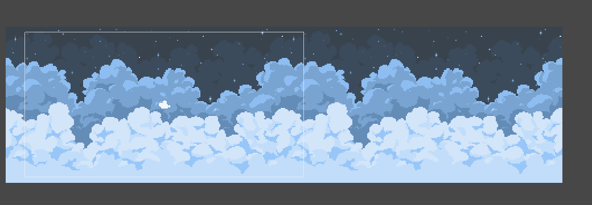
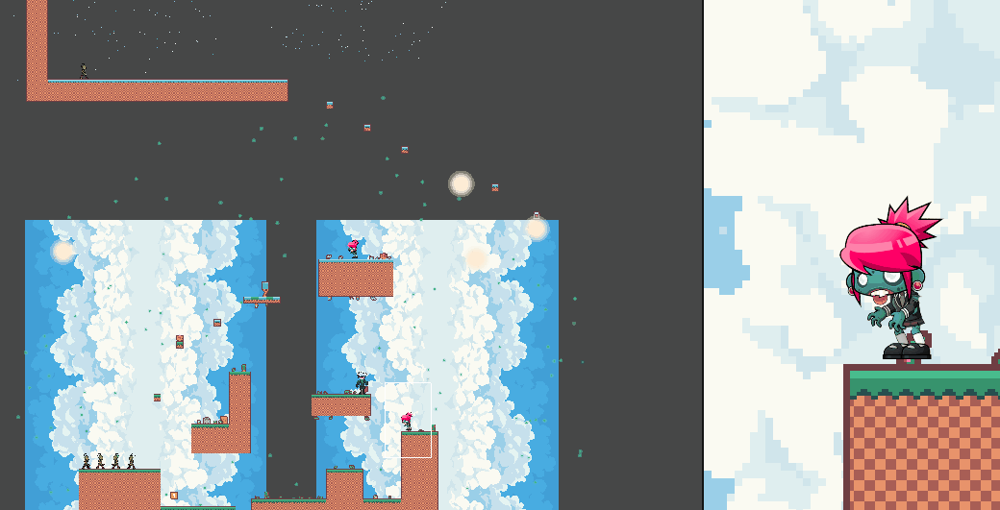
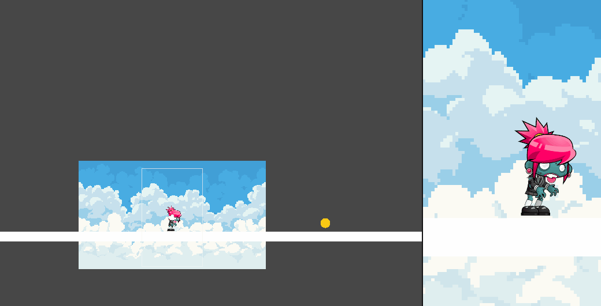

# Técnicas.
## Autor: Álvaro González Rodríguez
alu0101202556

Desarrollar ejemplos que implementen los siguientes casos:

* Scroll con movimiento del fondo.

El escenario cuenta con dos fondos y una cámara. El script tiene como referencia la posición de la cámara y uno de los fondos. Cuando la cámara llegue al límite del fondo actual se traslada el fondo que está atrás hacia adelante.
 Cada fondo tiene un script asociado. 

	void Update()
    {
        transform.Translate(Vector3.left * Time.deltaTime * 2);

        SpriteRenderer spr = this.GetComponent<SpriteRenderer>();
        float width = spr.size.x;

        if(this.transform.position.x + width < cameraTransform.position.x)
        {
            transform.position = new Vector3(otherBg.position.x + width, otherBg.position.y, otherBg.position.z);
        }
    }
	
*Scroll con movimiento del personaje.

Estamos reutilizando uno de los escenarios de anteriores prácticas. Ahora quien tiene el script para el movimiento del fondo es el jugador. En este caso el fondo consta de 8 imagenes, por lo que se les pasa la posición de todas al scritp, al igual que la posición de la cámara.
 En el momento que la posición de la cámara llegue al límite del fondo, el fondo que se encuentra fuera de la cámara se mueve y ahora se compruba la posición de la cámara con este fondo que se acaba de mover.

	float size = cCamera.orthographicSize;
	float spacing = sprRend.size.x * 1.5f;

    if(tCamera.position.y - size > fondoADer.position.y + sprRend.size.x * 1.5f && segundaFila == false){
		fondoADer.position = fondoCDer.position + Vector3.up * spacing;
		fondoAIzq.position = fondoCIzq.position + Vector3.up * spacing;
		fondoBDer.position = fondoDDer.position + Vector3.up * spacing;
		fondoBIzq.position = fondoDIzq.position + Vector3.up * spacing;
		segundaFila = true;
	} else if(tCamera.position.y + size < fondoADer.position.y - sprRend.size.x * 1.5f && segundaFila == true){
		fondoADer.position = fondoCDer.position - Vector3.up * spacing;
		fondoAIzq.position = fondoCIzq.position - Vector3.up * spacing;
		fondoBDer.position = fondoDDer.position - Vector3.up * spacing;
		fondoBIzq.position = fondoDIzq.position - Vector3.up * spacing;
		segundaFila = false;
	}
	if(tCamera.position.y - size > fondoCDer.position.y + sprRend.size.x * 1.5f && segundaFila == true){
		fondoCDer.position = fondoADer.position + Vector3.up * spacing;
		fondoCIzq.position = fondoAIzq.position + Vector3.up * spacing;
		fondoDDer.position = fondoBDer.position + Vector3.up * spacing;
		fondoDIzq.position = fondoBIzq.position + Vector3.up * spacing;
		segundaFila = false;
	}else if(tCamera.position.y + size < fondoCDer.position.y - sprRend.size.x * 1.5f && segundaFila == false){
		fondoCDer.position = fondoADer.position - Vector3.up * spacing;
		fondoCIzq.position = fondoAIzq.position - Vector3.up * spacing;
		fondoDDer.position = fondoBDer.position - Vector3.up * spacing;
		fondoDIzq.position = fondoBIzq.position - Vector3.up * spacing;
		segundaFila = true;
	}

*Fondo con efecto parallax. El efecto empieza cuando el jugador empieza a moverse, esto se debe comunicar mediante eventos.

Ahora se necesita tener 3 quads diferentes, uno para cada textura del cielo. En cuanto el jugador se mueve se tiene que enviar un evento al script del movimiento paralax para mover el fondo. Es por esto que este script también lo tiene que llevar el jugador.

    void Start()
    {
        jumpMovement.moveParallax += moveLayers;
        foreach (var layer in sky)
        {
            Material m = layer.material;
            m.mainTexture.wrapMode = TextureWrapMode.Repeat;
        }
    }

    private void moveLayers(float x, float y)
    {
        int i = 0;
        foreach (var layer in sky)
        {
            Material m = layer.material;
            m.SetTextureOffset("_MainTex", m.GetTextureOffset("_MainTex") + (new Vector2(x, y) * speed / ((i + 1) * 20.0f)));
            i++;
        }
    }
	
*Utilizar la técnica de pool de objetos para ir creando elementos en el juego que el jugador irá recolectando.

Para la técnica del pool de objetos necesitamos dos script diferentes, uno que represente el objeto que estará dentro del pool y otro que será el propio pool de objetos. Al iniciarse se instancian todos los objetos pero estarán todos inactivos. Con el método InvokeRepeating se activará un objeto del pool cada 2 segundos.
 Si el jugador choca con uno de ellos se volverá a desactivar y tendrá que esperar a que el InvokeRepeating lo vuelva a activar.

	void Start()
    {
        int increment = 0;
        pool = new GameObject[size];
        for(int i = 0; i < pool.Length; i++){
            pool[i] = Instantiate(coin, this.transform.position + new Vector3(this.transform.position.x + 2.0f + increment, this.transform.position.y, this.transform.position.z), Quaternion.identity);
            pool[i].SetActive(false);
            pool[i].GetComponent<Coin>().SetID(index);
            increment += 2;
        }

        InvokeRepeating(nameof(Spawn), 0.0f, 2.0f);
    }

    private void Spawn()
    {
        pool[index].SetActive(true);
        index++;

        if (index >= size)
        {
            index = 0;
        }
    }